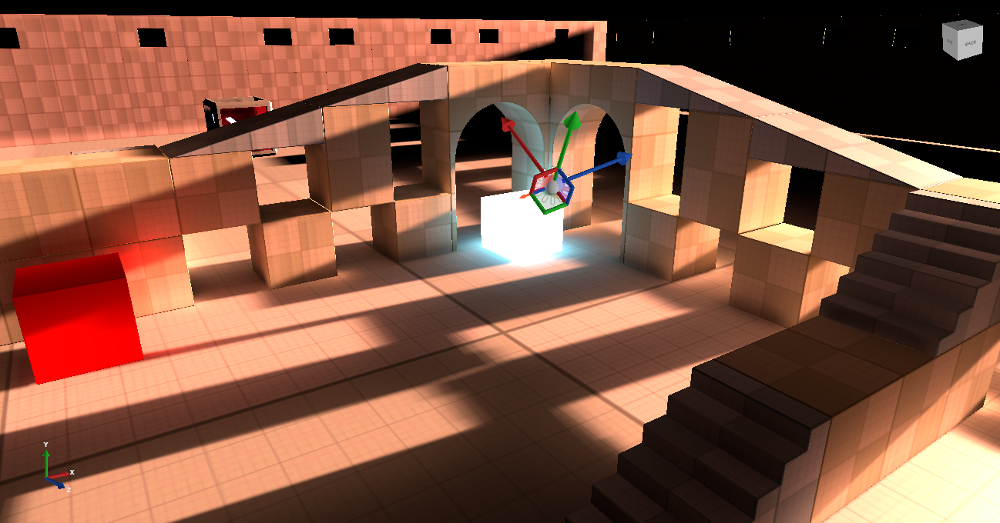
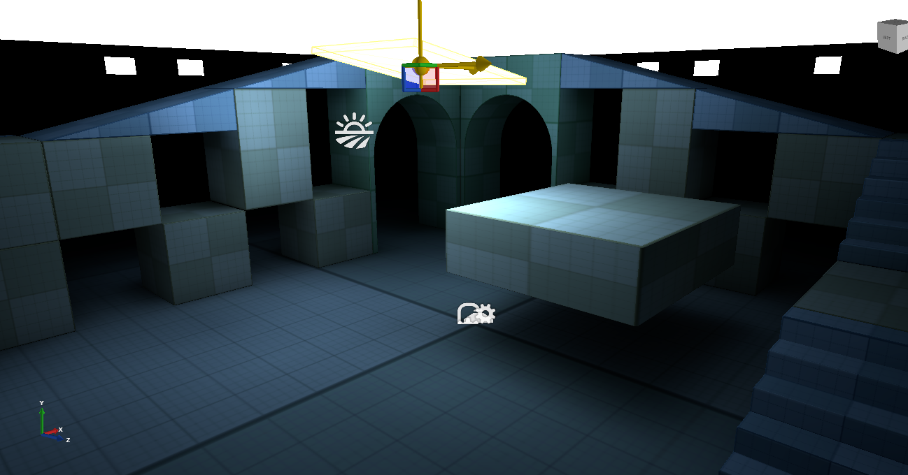

# XenkoVoxelGI
A voxel cone tracing implementation for the Xenko game engine!  
It's in its early stages but feel free to check it out.  

## Demo
Download an demo build <a href="https://forums.xenko.com/t/voxel-gi-implementation/1947/6?u=spike1">here</a>!

## Setup  

	
	

Prerequisite  
    You'll need to compile the Xenko fork [here](https://github.com/WhyPenguins/xenko), on the branch GIPatches. I had to add a few features to Xenko for the rest of it to work, the changes are really small so check them out if you wish.  

After that's compiled, you can load up the project here and have a look!  

## Features  

 Voxelization
- - [X] Geometry shader based axis projection
- - [ ] Averaging of fragments lying in the same voxel
- - [x] Solid voxelization (fills areas between front and backfaces with solid black)
- - [x] Downsampling to mip-maps
- - [x] MSAA voxelization
- - [x] Clipmaps
- - [x] Anisotropic Voxels
- - [ ] Partial revoxelization

Cone Tracing
- - [x] 12 cone diffuse light
- - - [x] More cone setups for different quality
- - [x] Infinite bounces (one frame delay between each one)
- - [x] Specular
- - [ ] Refraction
- - [ ] Sky light based on sky box?

UI
- - [x] Debug Voxels
- - [x] Voxel Volume Component
- - [x] Voxel Light Type
